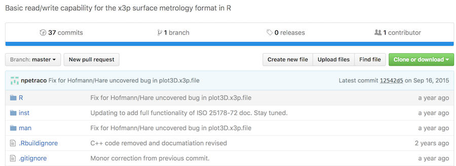

```{r setup, include=FALSE}
knitr::opts_chunk$set(echo = TRUE)
```

## Background

We have compiled this document in response to a serious accusation raised by a reviewer of our paper Automatic Matching of Bullet Lands. The accusation is reproduced below:

*The main methods used in the paper under review are **extremely dependent on Dr. Petraco's work** (implemented in an R library x3pr and available at https://github.com/npetraco). The authors built a new library titled x3prplus (available at https://github.com/heike/x3prplus) on top of x3pr. While working on my review, I went through a large amount of the two R libraries on github. **The new library mainly appears to be wrappers for Dr. Petraco’s work**. I find it very disconcerting and highly inappropriate that the authors are relying on Dr. Petraco’s work to such a high degree and that they are not referencing his work in their paper.*

In this document, we will show quite easily that this accusation is demonstrably false. To begin, we can easily access all exported functions of the `x3pr` package with a call to `getNamespace`. If we do so for `x3pr`, we obtain the following list:

```{r}
ls(getNamespace("x3pr"))
```

Performing the same task for `x3prplus`:

```{r}
ls(getNamespace("x3prplus"))
```

We will use these functions to illustrate the vast separation of functionality between the two packages.

## Function Similarities

Did we attempt to take credit for work that was done by Dr. Petraco? Below is a list of all the functions available in the `x3pr` package (accessed 10/10/2016). Further down, you can see the list of all the functions available in `x3prplus`. As is clear from the function names and descriptions, **there is virtually no overlapping functionality**. In general, Dr. Petraco's functions are about reading and parsing file formats. Our functions assume the reading step has already taken place, and compromise a much broader set of statistics and data science functionality including fitting models, deriving features, detecting grooves in bullet lands, and more.

x3pr Function              Comparable x3prplus Function Description                   
-------------------------- ---------------------------- -----------
launch_3Dview              None                         Shiny app to view a 3D surface
lms2x3p.file               None                         Convert a Zeiss LMS file to an X3P format
make.x3p.header            None                         Put together the XML format x3p header
plot3D.x3p.file            $\text{None}^1$              3D plot of a surface in X3P format
print.x3p.file.info        None                         Format (most) x3p header file info
read.digital.surf.file     None                         Read in a Digital Surf file
read.digital.surf.header   None                         Read the header off a Digital Surf file
read.digital.surf.profiles None                         Read in the surface data of a Digital Surf file
read.x3p                   read.x3pplus                 Read an x3p file
read.zeiss.lms.file        None                         Read a surface file in Zeiss LMS format
read.zeiss.lms.header      None                         Read the header off a Zeiss LMS file
read.zeiss.lms.profiles    None                         Read out surface data in Zeiss LMS format
sur2x3p.file               None                         Convert a read in .sur file to x3p
write.x3p                  $\text{None}^2$              Write a x3p format file

1: `x3prplus` includes an internal function, `plot_3d_land`, which uses the plotly package to produce a surface plot of a bullet land. This function is not accessible to users and uses no functionality from the `x3pr` function `plot3D.x3p.file`.

2: The `unfortify_x3p` function converts a data frame representation of a bullet land into the surface matrix version native to `x3pr`. However, this does not depend on the `write.x3p` code, nor does it have any of the disk writing functionality.

## Function Wrappers

It is rather trivial to assess the claim that `x3prplus` "mainly appears to be wrappers" for `x3pr`. In fact, we can very simply determine the unique number of `x3pr` functions in use by `x3prplus` to determine whether there is any evidence that `x3prplus` is merely a wrapper. 

x3prplus Function    x3pr Function Used Description
-------------------- ------------------ -----------
boot_fit_loess       None               Fit a LOESS model with bootstrap samples
bulletAlign          None               Align two surface cross cuts according to maximal correlation
bulletAlign_dtw      None               Align two surface cross cuts according to maximal correlation
bulletAlign_nist     None               Align two surface cross cuts according to maximal correlation
bulletCheckCrossCut  None               Identifying a reliable cross section
bulletGetMaxCMS      None               Identify the number of maximum CMS between two bullet lands
bulletGetMaxCMS_nist None               Identify the number of maximum CMS between two bullet lands
bulletSmooth         None               Smooth the surface of a bullet
CMS                  None               Table of the number of consecutive matches
fit_loess            None               Fit a loess curve to a bullet data frame
fortify_x3p          None               Convert a list of x3p file into a data frame
get_bullet           None               Deprecated function use get_crosscut
get_crosscut         None               Read a crosscut from a 3d surface file
get_grooves          None               Find the grooves of a bullet land
get_peaks            None               Identify the location of peaks and heights at a crosscut
get_peaks_nist       None               Identify the location of peaks and heights at a crosscut
getCircle            None               Estimate center and radius
getTwist             None               Estimate the twist in a bullet land
maxCMS               None               Number of maximum consecutively matching striae
predCircle           None               Estimate predictions and residuals for a circle fit of x and y
predSmooth           None               Estimate predictions and residuals for a smooth of x and y
processBullets       None               Process x3p file
read.x3pplus         read.x3p           Read X3P File with option to transpose matrix
sample.x3p           None               Sample every X element of a data frame
smoothloess          None               Predict smooth from a fit
striation_identify   None               Match striation marks across two cross sections
unfortify_x3p        None               Convert a data frame into an x3p file

In total, **there is exactly one single function call made to an `x3pr` function**. This is a function we wrote, `read.x3pplus`, which extends `read.x3p` with a simple option to transpose the resulting matrix. Not a single other `x3pr` function is ever called in `x3prplus`. Comparatively, we call dozens of unique functions belonging to the `ggplot2` package. It is clear that we aren't attempting to be a wrapper for `x3pr` anymore than we are a wrapper for `ggplot2`. In fact, the set of functionality of both packages is wildly different, as can be seen from a simple read of the function descriptions in the two tables above.

In other words, the claim that `x3prplus` is "extremely dependent on Dr. Petraco's work" is demonstrably false. As a matter of fact, we have an internal version of the code which replaces the single use of Dr. Petraco's code, in our `read.x3pplus` function, with a natively written XML parser. Nonetheless, we would prefer to build on Dr. Petraco's work, which is most certainly in the spirit of open-source software and academic research. This is also likely why Dr. Petraco has made his code publicly available on GitHub.

## Referencing x3pr

The question remains of whether despite only using a single function of `x3pr`, and our package bearing virtually no similarlity in terms of functionality, did we fail to provide proper attribution of the package. Dr. Petraco contacted Eric regarding this issue, in an email which was CCed to his major professor (Dr. Heike Hofmann), the director of CSAFE (Dr. Alicia Carriquiry), the Department Chair of Statistics at Iowa State University (Dr. Max Morris) and the CSAFE contract officer at NIST (Susan Ballou). Dr. Petraco claimed "I am puzzled however as to why no citation appears to this work anywhere in your text as `x3pr` contributed critically to it." The paper referenced was a pre-publication version published to Arxiv, and was still in the revision stage. Eric acknowledged the omission of the direct reference to `x3pr` in the pre-publication paper, and added it that afternoon, within hours of receiving the email:

https://github.com/erichare/imaging-paper/commit/c63cfeee7134222a9b760752fca80084aadad866

Further, numerous other references to Dr. Petraco and `x3pr` have existed within the context of our package `x3prplus`, including but not limited to:

1. The README for the package: https://github.com/heike/x3prplus
2. Presentations given on x3prplus and our algorithm
	- https://github.com/heike/x3prplus/blob/presentations/jsm-2016/slides.Rmd
	- https://github.com/heike/x3prplus/blob/presentations/graphics-group-2015/slides.Rmd
	- https://github.com/heike/x3prplus/blob/presentations/forensics-group-late2016/slides.Rmd
3. Within the package description itself.
4. Directly in the name of the package `x3prplus`

As a matter of fact, we submitted a pull request in order to fix an issue in `x3pr` which was detected over a year ago. Dr. Petraco merged it in to fix the bug, as can be seen by this screenshot taken October 11th. This is also the most recent change that Dr. Petraco has made to his package, and predates serious work on `x3prplus`.

```{r, echo=FALSE}

```

Although using `x3pr` merely to read in the data, we felt that it was important to reference the work that had been put into it. Given this, the reviewer finding our package "very disconcerting" and "highly inappropriate" is quite frankly a very strange assertion, particularly given the lack of any evidence provided in the review.
